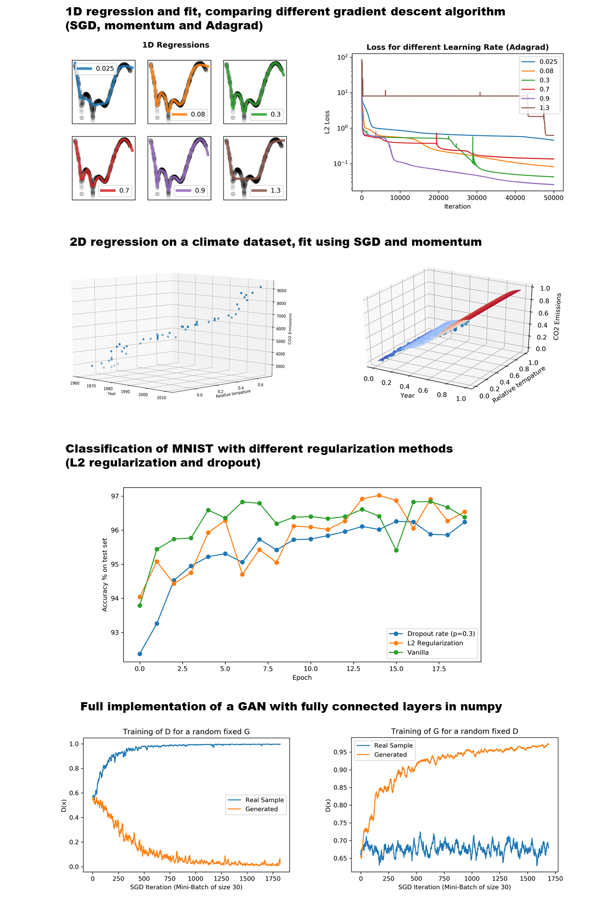

# Fourier and Edge Loss for GAN-Based Single Image Super Resolution

This repository is part of the work I did during my year at Osaka University
with the exchange program with FrontierLab@OsakaU.

It contains 4 different notebooks that detail, with indepth comments, basic multilayer perceptrons coded only numpy.
The dataloader and part of the classifier is inspired by "mnielsen" https://github.com/mnielsen/neural-networks-and-deep-learning

